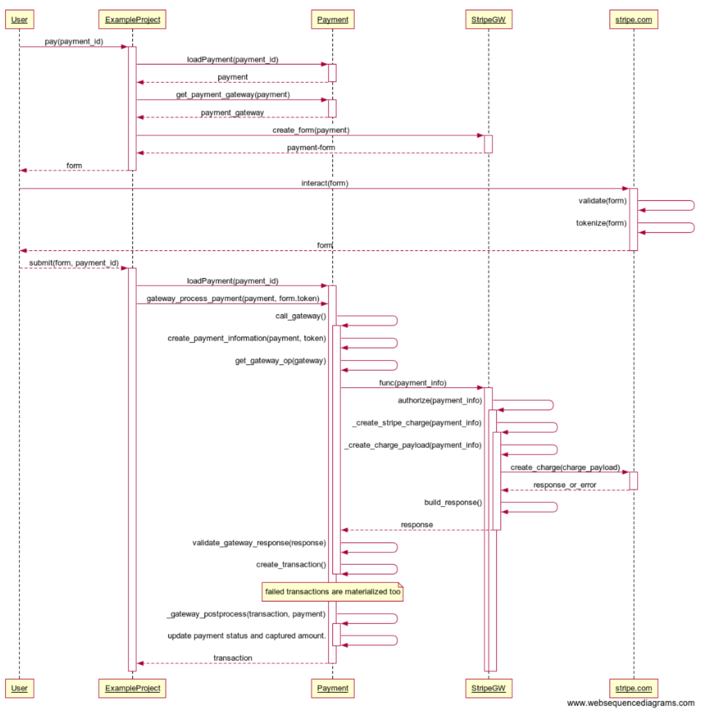

Rationale
---------
The idea is to use the design and implementation of the payment gateways in saleor,
without pulling in the rest of saleor. 
Saleor wants to eventually separate the payment part from the rest of saleor: https://github.com/mirumee/saleor/issues/3422 
but that change hasn't landed.

I last retrieved the saleor code on 2019-06-24, commit hash: 509cb4530


General architecture
--------------------
Client code interacts with the Payment django entity and with gateway-independent functions (in utils.py).

There is also an SPI that each payment gateway implements:
 - The functions a gateway must implement are not formally defined but can be seen 
in function get_gateway_operation_func (in utils.py)
 - interface.py defines the data-objects that are exchanged with the gateway implementation
    (Note: The Payment billing and shipping addresses are for optional fraud checking).

The interaction between a user and the payment gateway are not captured by a generic contract because it
is impossible to abstract over the myriad ways the different payment gateways do that part.

Here is a diagram of how the different parts interact:




Our changes
-----------
- This module is concerned by payment only, it should not depend on application-specific things like orders.
- We don't want to depend on postgres, so we replace jsonfield by textfield
 (I found a django jsonfield module but it's not very useful and is also unmaintained)
- Remove the DEFAULT_CURRENCY setting: we prefer to explicitely manage currencies.
- We don't want to depend on the saleor homegrown money class, instead we use django-money.
- Whenever we represent money, we always include the currency (whole value idiom).
- Use the django admin instead of a handcrafted UI for administrative tasks.


Manifest
--------
This package contains:
- The interface of saleor payments.
- The ```stripe``` and ```dummy``` saleor gateways package and tests 
    (we don't need the braintree and razorpay implementations, but could re-add them eventually)
- A modified copy of models.py (to remove references to saleor orders and to the saleor custom money)
- A modified copy of utils.py (again to remove references to saleor orders, to the saleor custom money, and to order-related things)
- A modified copy of stripe/init.py (to fix a bug when we just want to authorize)
- A new localized django admin for payments and transactions.

