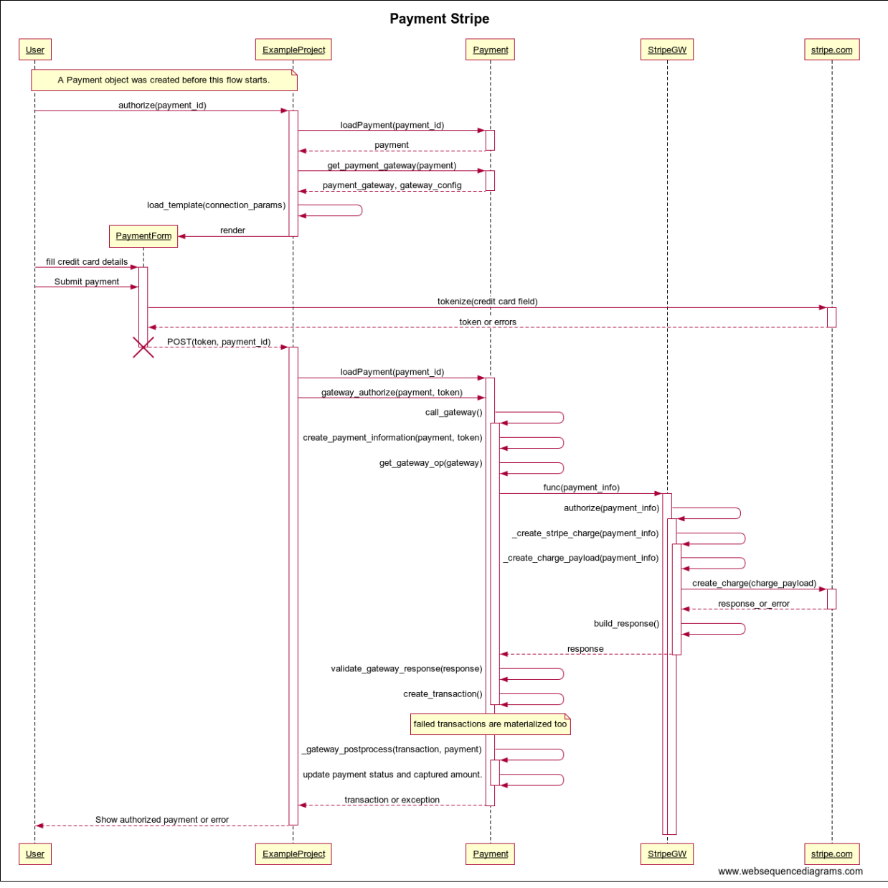

# Stripe

## General flow




## Split payments

There three different ways to use stripe connect: https://stripe.com/docs/connect/charges#choosing-approach

We choose to use destination charges: https://stripe.com/docs/connect/destination-charges

For destination charges there are again two choices on how to split the funds: `application_fee` or `amount`.

We've implemented the `amount` option.


Split payments are configured with an optional `STRIPE_CONNECT` setting:

transfer_destination is the id of the destination account ().
transfer_percent is a number between 0 and 100. For instance 90 means that the destination will receive 90% of the charge amount.

Example:

```
STRIPE_CONNECT = {
    'transfer_destination': 'acct_1Es1XuECDoeqctKE',
    'transfer_percent': 90
}
```
